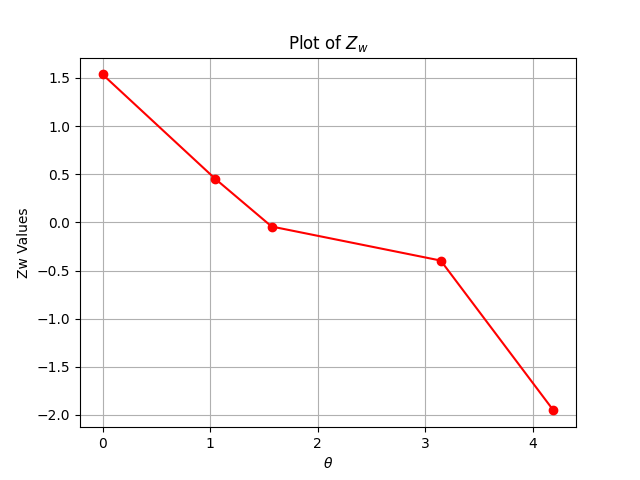

# quantum_algo_exercises
# 1
## 1.a

### QFT

### Inverse QFT

## 1.b

## 1.c
The result from b is encoded to the circuit with simple operations, then to reconstruct the original stage we used the inverse QFT and then $InverseQFT*QFT* \phi=\phi$. For more info see the src code: src/HW1.py

## 1.d
We can see that for j=2,6 the value is low, this is the excepted result from the original stage. 

# 2

# 3

# 4
## 4.a

## 4.b
### (i)

### (ii)

Note that
$$\Delta_3(\Pi_\phi, |1\rangle\langle 1| \Pi_\psi)$$
is computed as: 
$\Delta_3(\Pi_\phi, |1\rangle\langle 1| \Pi_\psi)$ = $\text{Tr}(\Pi_\phi |1\rangle\langle 1| \Pi_\psi)$  
= $\text{Tr}(\langle 1| \Pi_\psi \Pi_\phi |1\rangle)$  
= ${\Pi_\psi \Pi_\phi} (2, 2)$  
= $\text{Tr}(\Pi_\psi \Pi_\phi) - (\Pi_\psi \Pi_\phi)(1,1)$  
= $\Delta_2(\Pi_\psi \Pi_\phi) - \Delta_3(\Pi_\phi |0\rangle\langle 0| \Pi_\psi)$  

Since the right-hand side has already been calculated, we can now compute the left-hand side directly without any further measurements.
### Answer
Recall that $Z$ is defined as:

$$Z = 1 \cdot |0\rangle\langle 0| + (-1) \cdot |1\rangle\langle 1|$$

We will now use the identity proven in part 4(a), along with the previously computed values of $\Delta_2$ and $\Delta_3$, to compute $Z_w$:

$$Z_w = \frac{\Delta_3(\Pi_\phi |0\rangle\langle 0| \Pi_\psi)}{\Delta_2(\Pi_\phi \Pi_\psi)} - \frac{\Delta_3(\Pi_\phi |1\rangle\langle 1| \Pi_\psi)}{\Delta_2(\Pi_\phi \Pi_\psi)}$$

The result $Z_w$ can be computed directly using the above equation.

